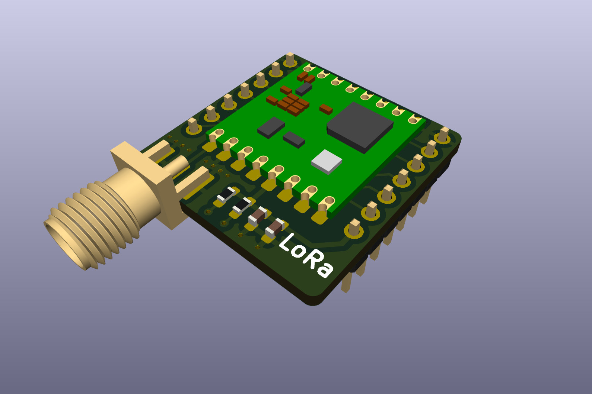
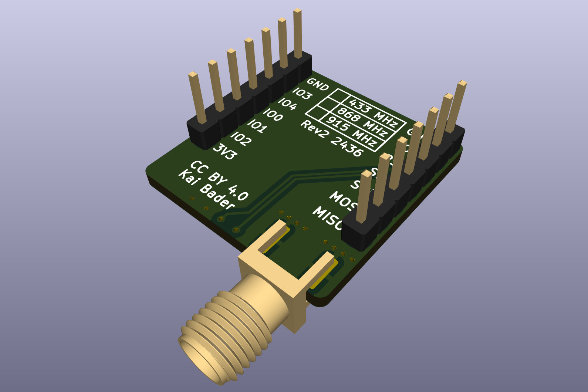
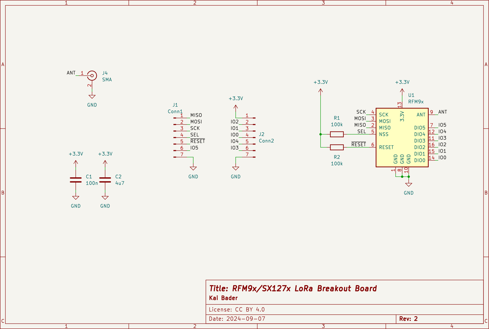

# LoRa Breakout Board for RFM95/RFM96 and SX1276/SX1278 Modules

This repository contains KiCad design files for a breadboard-friendly breakout board that supports various LoRa modules, such as the **HopeRF RFM95/RFM96** or Semtech **SX1276/SX1278**-based modules like the HPD13A and G-NiceRF LoRa1276-C1.

## Features

| Top View | Bottom View |
| -------- | ----------- |
|  |  |

- Supports **HopeRF RFM95/RFM96** and other pin-compatible LoRa modules.
- Designed to fit standard breadboards for easy prototyping.
- Simple SPI-based communication with microcontrollers.

## Schematic Overview

The breakout board includes the following key components and connections:

### 1. **LoRa Module**
   - This module, based on the SX1276 transceiver, handles LoRa communication at 868 MHz or 915 MHz.
   - It communicates with the microcontroller via the **SPI interface** (SCK, MOSI, MISO, NSS pins).
   - Additional **DIO pins (DIO0-DIO5)** are exposed, allowing the module to send interrupts or general-purpose I/O signals.
   - **Antenna**: The RFM9x is connected to an external antenna via an SMA connector for wireless communication.

### 2. **SPI Interface**
   - The SPI interface is used to connect the RFM9x to a microcontroller, with signals for **MISO, MOSI, SCK, NSS (SEL)**, and a **RESET** pin.
   - This enables the module to send and receive data through standard SPI communication.

### 3. **DIO Pin Connector**
   - The board provides access to the **DIO0-DIO5 pins**, which are general-purpose input/output pins for signaling and interrupt control. These can be connected to a microcontroller for event-driven handling of LoRa transmissions.

### 4. **Antenna Connection (SMA)**
   - The **SMA connector** is used to attach an external antenna, which is crucial for enabling long-range LoRa communication.

### 5. **Power Supply and Decoupling Capacitors**
   - The board operates at **+3.3V** and includes two decoupling capacitors:
     - **C1 (100nF)** and **C2 (4.7uF)** help filter out noise and stabilize the power supply to ensure proper operation of the LoRa module.
   - These capacitors prevent voltage fluctuations from affecting the module's performance, especially during transmission.

### 6. **Reset Circuit**
   - The **RESET pin** is connected to a 100k pull-up resistor **(R2)**, and another 100k resistor **(R1)** is used to control the accessibility (via **SEL**) of the module.
   - This allows external control for reinitializing the module as needed.

## Pin-Compatible LoRa Modules

This breakout board is designed to be compatible with the **HopeRF RFM9x** series and the following pin-compatible alternatives:

1. **HopeRF RFM95** (by HopeRF):
   - A widely used LoRa transceiver module that supports long-range, low-power wireless communication.
   - **Manufacturer**: [HopeRF](https://www.hoperf.com).

2. **HPD13A** (by HPD Technology):
   - A pin-compatible and shielded alternative to the RFM95, based on the SX1276 transceiver.
   - **Manufacturer**: [HPD Technology](http://www.hpdtek.com).

3. **G-NiceRF LoRa1276-C1** (by NiceRF):
   - A pin-compatible module using the same SX1276 chip as the HPD13A, designed for similar wireless communication applications.
   - **Manufacturer**: [NiceRF](https://www.nicerf.com).

Feel free to inform me about other alternatives that are available and pin-compatible.

## License

This project is licensed under the **Creative Commons Attribution 4.0 International (CC BY 4.0)**. See the [LICENSE](https://creativecommons.org/licenses/by/4.0/) page for details.
